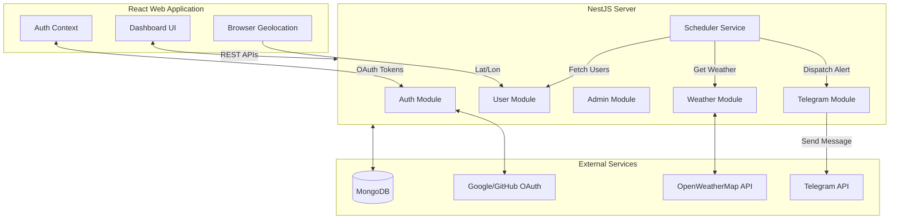
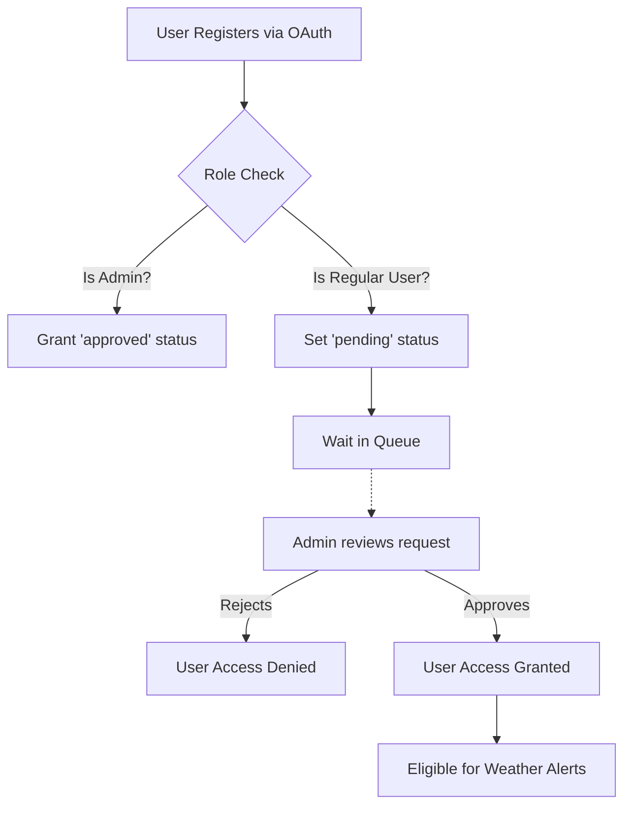
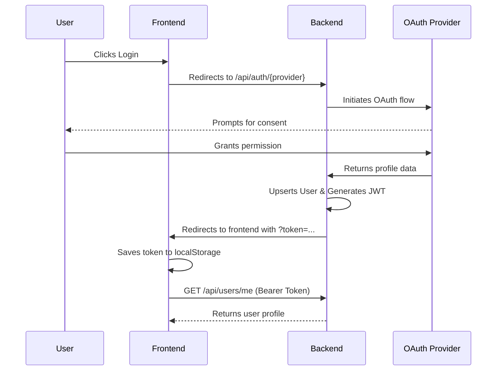
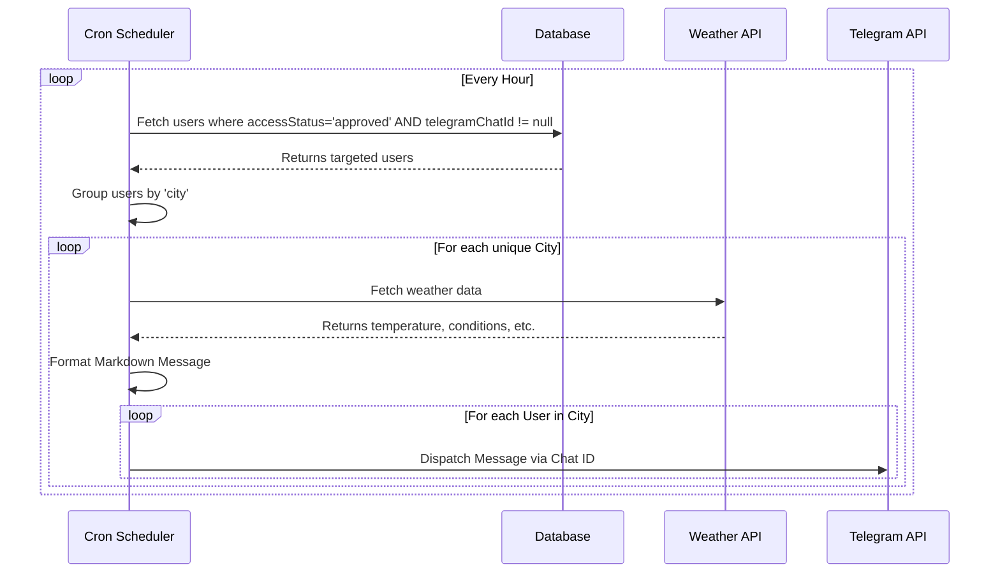

# 🌤️ WeatherGuard Admin

[](https://opensource.org/licenses/MIT)
[](https://nodejs.org/)
[](https://nestjs.com/)
[](https://reactjs.org/)

**WeatherGuard Admin** is a secure, invite-only weather alert service that connects a web-based administrative dashboard with a personalized Telegram bot. It is designed with clean architecture and modular principles to provide targeted weather notifications strictly to approved users.

---

## 📖 Table of Contents
1. [Project Overview](#-project-overview)
2. [Features](#-features)
3. [Tech Stack](#-tech-stack)
4. [System Architecture](#-system-architecture-overview)
5. [Folder Structure](#-folder-structure)
6. [Database Schema](#-database-schema)
7. [System Flows](#-system-flows)
   - [Data Flow (Access Control)](#1-data-flow-access-control)
   - [Authentication Flow](#2-authentication-flow)
   - [Telegram Integration Flow](#3-telegram-integration-flow)
   - [Scheduling Flow](#4-weather-alert-scheduling-flow)
8. [API Documentation](#-api-endpoints)
9. [Environment Variables](#-environment-variables)
10. [Local Development & Setup](#-local-development-setup-instructions)
11. [Deployment](#-deployment-instructions)
12. [Future Improvements](#-future-improvements)
13. [Media & Links](#-media--links)

---

## 🔭 Project Overview

WeatherGuard Admin bridges the gap between secure web management and instant messaging. Upon logging in via social authentication, users are placed in a "pending" queue. Administrators can approve or reject access requests through the centralized admin dashboard. 

Once approved, users can connect their Telegram account and use browser geolocation to auto-detect their city. A background scheduler periodically fetches data from OpenWeatherMap and dispatches personalized, localized weather alerts directly to the user's Telegram.

## ✨ Features

* **Social Authentication**: Frictionless login using Google and GitHub OAuth.
* **Invite-Only Access**: New users default to a `pending` state and must request access.
* **Admin Dashboard**: Comprehensive UI for administrators to approve, reject, and manage users.
* **Strict Authorization**: Only explicitly `approved` users receive weather notifications.
* **Telegram Integration**: Seamless binding of Telegram chat IDs to user accounts.
* **Smart Location Tracking**: Browser Geolocation API integration to automatically detect and save the user's city.
* **Personalized Alerts**: Weather notifications are fetched and formatted per-city, minimizing redundant API calls.
* **Automated Scheduling**: Reliable background cron jobs power the notification delivery engine.

## 💻 Tech Stack

| Layer | Technology | Description |
|-------|------------|-------------|
| **Frontend** | React, Tailwind CSS | Vite-powered SPA with responsive glassmorphism UI |
| **Backend** | NestJS | Modular, scalable Node.js framework using TypeScript |
| **Database** | MongoDB, Mongoose | NoSQL database for flexible schema management |
| **Auth** | Passport.js, JWT | Secure stateless authentication via Google/GitHub strategies |
| **Messaging** | Telegram Bot API | Direct-to-user push notifications via `node-telegram-bot-api` |
| **Weather API**| OpenWeatherMap | Real-time meteorological data resolution |
| **Scheduling** | `@nestjs/schedule` | Integrated `node-cron` wrapper for task scheduling |

---

## 🏗️ System Architecture Overview



---

## 📂 Folder Structure

The project adopts a monorepo-style structure, dividing concerns cleanly between the `client` (Frontend) and `src` (Backend).

```text
weatherguard-admin/
├── client/                     # React Frontend
│   ├── public/                 # Static assets
│   ├── src/                    
│   │   ├── components/         # Reusable UI elements (Cards, Buttons)
│   │   ├── constants/          # Configuration & Enums
│   │   ├── context/            # Global state (AuthContext)
│   │   ├── hooks/              # Custom React hooks
│   │   ├── pages/              # Route-level components
│   │   └── services/           # Axios API wrappers
│   └── .env                    # Frontend environment variables
│
├── src/                        # NestJS Backend
│   ├── admin/                  # Admin user management
│   ├── auth/                   # OAuth strategies and JWT logic
│   ├── common/                 # Guards, Decorators, Interceptors
│   ├── config/                 # Centralized configuration mapping
│   ├── scheduler/              # Cron jobs and automated tasks
│   ├── telegram/               # Telegram bot integration
│   ├── users/                  # User CRUD and profile management
│   └── weather/                # OpenWeatherMap integration
│
├── .env                        # Backend environment variables
└── package.json                # Root dependencies & scripts
```

---

## 🗄️ Database Schema

### User Schema

The core entity of the application is the `User`. 

| Field | Type | Description |
|-------|------|-------------|
| `_id` | ObjectId | MongoDB unique identifier |
| `name` | String | Full name from OAuth provider |
| `email` | String | Unique email address |
| `provider` | String | `google` or `github` |
| `role` | String | `admin` or `user` |
| `accessStatus` | String | `pending`, `approved`, or `rejected` |
| `telegramChatId` | String | Unique ID for sending bot messages |
| `city` | String | User's preferred city for weather alerts |
| `avatar` | String | URL to the user's profile picture |

---

## 🔄 System Flows

### 1. Data Flow (Access Control)
Only fully verified and approved users are eligible to receive alerts.



### 2. Authentication Flow


### 3. Telegram Integration Flow
1. User searches for the bot on Telegram and sends `/start`.
2. The bot responds with the user's unique `telegramChatId`.
3. User pastes the Chat ID into the WeatherGuard Web Dashboard.
4. Frontend triggers `PATCH /api/users/connect-telegram`.
5. The Chat ID is securely bound to the user's database record.

### 4. Weather Alert Scheduling Flow
The background job prioritizes efficiency by grouping users by city, avoiding duplicate API calls to OpenWeatherMap.



---

## 🔌 API Endpoints

### Auth Endpoints
| Method | Route | Description | Auth Required |
|--------|-------|-------------|---------------|
| `GET` | `/api/auth/google` | Initiate Google OAuth | No |
| `GET` | `/api/auth/github` | Initiate GitHub OAuth | No |

### User Endpoints
| Method | Route | Description | Auth Required |
|--------|-------|-------------|---------------|
| `GET` | `/api/users/me` | Fetch active user profile | Yes |
| `GET` | `/api/users/status` | Check access status/role | Yes |
| `PATCH` | `/api/users/connect-telegram`| Link Telegram Chat ID | Yes |
| `PATCH` | `/api/users/city` | Manually update preferred city | Yes |
| `PATCH` | `/api/users/detect-city`| Resolve & save city via Lat/Lon | Yes |

### Admin Endpoints
| Method | Route | Description | Auth Required |
|--------|-------|-------------|---------------|
| `GET` | `/api/admin/users` | List all registered users | Yes (Admin) |
| `PATCH` | `/api/admin/users/:id/status`| Update user `accessStatus` | Yes (Admin) |

---

## 🔐 Environment Variables

### Backend (`/.env`)
```env
MONGODB_URI=mongodb+srv://<user>:<password>@cluster...
JWT_SECRET=your_super_secret_jwt_key
JWT_EXPIRES_IN=7d

GOOGLE_CLIENT_ID=your_google_client_id
GOOGLE_CLIENT_SECRET=your_google_client_secret
GOOGLE_CALLBACK_URL=http://localhost:3000/api/auth/google/callback

GITHUB_CLIENT_ID=your_github_client_id
GITHUB_CLIENT_SECRET=your_github_client_secret
GITHUB_CALLBACK_URL=http://localhost:3000/api/auth/github/callback

TELEGRAM_BOT_TOKEN=your_telegram_bot_token
OPENWEATHERMAP_API_KEY=your_openweathermap_api_key
DEFAULT_CITY=London

FRONTEND_URL=http://localhost:5173
PORT=3000
```

### Frontend (`/client/.env`)
```env
VITE_API_URL=http://localhost:3000/api
```

---

## 🚀 Local Development Setup Instructions

### Prerequisites
* **Node.js** (v18 or higher)
* **MongoDB** (Local instance or MongoDB Atlas)
* Accounts set up for **Google Cloud Console**, **GitHub Developer Settings**, **OpenWeatherMap**, and a **Telegram Bot** (via @BotFather).

### Backend Setup
1. Clone the repository:
   ```bash
   git clone https://github.com/yourusername/weatherguard-admin.git
   cd weatherguard-admin
   ```
2. Install dependencies:
   ```bash
   npm install
   ```
3. Create a `.env` file in the root directory and populate it with the variables listed above.
4. Start the backend server:
   ```bash
   npm run start:dev
   ```

### Frontend Setup
1. Navigate to the client directory:
   ```bash
   cd client
   ```
2. Install dependencies:
   ```bash
   npm install
   ```
3. Create a `.env` file inside the `client` directory:
   ```bash
   echo "VITE_API_URL=http://localhost:3000/api" > .env
   ```
4. Start the Vite development server:
   ```bash
   npm run dev
   ```

The frontend will be accessible at `http://localhost:5173` and the backend at `http://localhost:3000`.

---

## 🌐 Deployment Instructions

### Deploying the Backend (e.g., Render, Railway, Heroku)
1. Push your code to a GitHub repository.
2. Connect your repository to your chosen platform.
3. Set the Build Command to `npm install && npm run build`.
4. Set the Start Command to `npm run start:prod`.
5. Populate the production environment variables in the platform's dashboard.

### Deploying the Frontend (e.g., Vercel, Netlify)
1. Import the repository into Vercel.
2. Set the Root Directory to `client`.
3. Set the Build Command to `npm run build` and Output Directory to `dist`.
4. Add the `VITE_API_URL` environment variable pointing to your deployed backend (e.g., `https://your-backend.onrender.com/api`).
5. Deploy.
